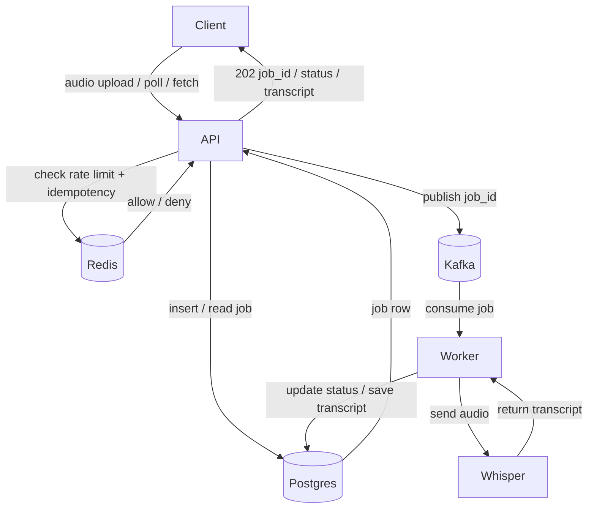

# Transcription API

Async, multi-user audio transcription API. Postgres for state, Redis for rate limiting + idempotency, Kafka for the job queue, worker as a separate process. Falls back to an in-memory mode for CI/dev without any infrastructure.

> **The "why" behind every choice** lives in [`DESIGN.md`](DESIGN.md) — problem framing, stack decisions with alternatives considered, multi-tenancy model, idempotency race handling, failure modes, trade-offs, and what we deliberately didn't build.

## Architecture



## Modes

| Mode | When | State | Queue | Rate limit |
|---|---|---|---|---|
| **In-memory** (default without `DATABASE_URL`, or `INMEMORY=1`) | Tests, local dev | Python dict | Thread | None |
| **Production** (`DATABASE_URL` set) | Everything else | Postgres | Kafka | Redis |

The public HTTP API is identical in both modes.

## Quick start (production stack)

```bash
# 1. Bring up Postgres, Redis, Kafka
docker compose up -d

# 2. Install deps
pip install -r requirements.txt

# 3. Configure
$env:DATABASE_URL   = "postgresql://tx:tx@localhost:5432/transcription"
$env:REDIS_URL      = "redis://localhost:6379/0"
$env:KAFKA_BOOTSTRAP = "localhost:9092"
$env:OPENAI_API_KEY = "sk-..."   # optional; omit to use mock transcriber

# 4. Seed a user + API key (prints the plaintext key once — save it)
python seed.py you@example.com --plan free

# 5. Run API + worker (separate terminals)
uvicorn app:app
python worker.py

# 6. Call it
curl -H "Authorization: Bearer tk_..." -F file=@audio.mp3 http://localhost:8000/v1/transcriptions
```

## Quick start (in-memory, no infra)

```powershell
pip install -r requirements.txt
uvicorn app:app                    # DATABASE_URL unset → in-memory mode
python record_and_transcribe.py    # end-to-end mic → transcript
```

## Endpoints

| Verb | Path | Success | Notes |
|---|---|---|---|
| POST | `/v1/transcriptions` | `202 { job_id, status }` | multipart `file`; `Idempotency-Key` header optional |
| GET  | `/v1/transcriptions/{id}` | `200 { status, error? }` | `queued \| processing \| done \| failed` |
| GET  | `/v1/transcriptions/{id}/transcript` | `200 { segments }` | `409` if not done; `404` if unknown/not yours |

## Authentication

**Production mode:** per-user API keys generated by `seed.py`, stored hashed in Postgres. Client sends `Authorization: Bearer tk_<key>`. Middleware looks up the SHA-256 hash, attaches the user to the request; every job is scoped by `user_id` (poll/fetch return `404` for other users' jobs).

**In-memory mode:** optional shared `API_KEY` env var (Bearer). If unset, auth is disabled — for tests only.

Both paths use `hmac.compare_digest` (constant-time) to prevent timing attacks.

## Rate limiting

Per-user, per-endpoint, sliding-window counter in Redis (Lua-scripted, atomic). Plans defined in [`ratelimit.py`](ratelimit.py):

| Plan | Submit | Poll | Fetch |
|---|---|---|---|
| `free` | 60/min | 300/min | 60/min |
| `pro` | 600/min | 3000/min | 600/min |

Over-limit responses:
```
HTTP/1.1 429 Too Many Requests
Retry-After: 60
X-RateLimit-Limit: 60
X-RateLimit-Remaining: 0
```

## Idempotency

- **Header:** `Idempotency-Key: <any string>` — same key from the same user returns the same job.
- **Fallback:** SHA-256 of the audio bytes, per-user — protects clients that don't cooperate.
- **Storage:** Redis `SET NX EX 86400` (atomic get-or-set) in production; in-memory dict in dev.

## Kafka topic layout

| Topic | Partitions | Key | Purpose |
|---|---|---|---|
| `transcriptions.submitted` | 32 | `user_id` | New jobs; workers consume with `enable_auto_commit=false` and commit only after successful write to Postgres + S3 |

Partitioning by `user_id` gives per-user ordering (a user's jobs process in submit order) and fair fan-out across the worker pool.

## Files

| File | Role |
|---|---|
| [`app.py`](app.py) | FastAPI app: endpoints, auth, rate-limit deps, in-memory fallback |
| [`worker.py`](worker.py) | Kafka consumer → Whisper → Postgres |
| [`db.py`](db.py) | asyncpg pool + query helpers |
| [`auth.py`](auth.py) | API key generation + hashing |
| [`ratelimit.py`](ratelimit.py) | Redis sliding-window Lua + idempotency `SET NX EX` |
| [`kqueue.py`](kqueue.py) | aiokafka producer/consumer |
| [`transcribe.py`](transcribe.py) | Whisper + mock transcribers |
| [`seed.py`](seed.py) | Create user + API key |
| [`schema.sql`](schema.sql) | Postgres DDL |
| [`docker-compose.yml`](docker-compose.yml) | Postgres 16 + Redis 7 + Kafka 3.7 (KRaft) |
| [`openapi.json`](openapi.json) | Committed OpenAPI 3.1 spec |
| [`export_openapi.py`](export_openapi.py) | Regenerate the spec |
| [`test_api.py`](test_api.py) | 13 tests (in-memory mode, no infra needed) |

## Monitoring — Prometheus + Grafana

Every API and worker instance exposes Prometheus metrics; docker-compose ships a pre-configured Prometheus scrape target and a Grafana dashboard.

### Endpoints
- API metrics:    `http://localhost:8000/metrics`
- Worker metrics: `http://localhost:9100/metrics`
- Prometheus:     `http://localhost:9090`
- Grafana:        `http://localhost:3000` (anonymous viewer; admin/admin to edit)

### What's tracked
| Category | Metric | Labels |
|---|---|---|
| HTTP | `http_requests_total`, `http_request_duration_seconds`, `http_requests_inflight` | method, endpoint, status |
| Auth | `auth_failures_total` | reason (`missing`\|`invalid`) |
| Rate limit | `rate_limit_rejections_total` | endpoint, plan |
| Jobs | `jobs_submitted_total`, `jobs_dedup_hits_total`, `jobs_completed_total`, `jobs_in_flight` | plan, status |
| Latency | `job_duration_seconds` (queue → terminal), `worker_transcribe_seconds` (Whisper call) | status |
| Upstream | `whisper_errors_total` | error_code |

### Dashboard panels (auto-provisioned)
Row 1 — RPS · error rate · in-flight jobs · jobs/min
Row 2 — request rate by endpoint · status codes
Row 3 — latency P50/P95/P99 · latency by endpoint (P95)
Row 4 — job throughput · job duration (queue → done)
Row 5 — Whisper latency · Whisper errors
Row 6 — auth failures · 429 rejections
Row 7 — dedup hits · in-flight requests by endpoint

Dashboard JSON: [`monitoring/grafana/dashboards/transcription-api.json`](monitoring/grafana/dashboards/transcription-api.json)

### Bring it up
```bash
docker compose up -d
# Grafana → http://localhost:3000  (dashboard auto-loads under "Transcription API")
```

## Interactive docs

- `http://localhost:8000/docs` — Swagger UI
- `http://localhost:8000/redoc` — ReDoc
- `http://localhost:8000/openapi.json` — raw spec (feed to `openapi-generator` for typed SDKs)

## Test

```bash
pip install pytest pytest-asyncio
pytest -v
```

13 tests cover: happy path, format validation, format acceptance, idempotency (header + content-hash), missing job, failure surfacing, early fetch → 409, auth (disabled/missing/wrong/correct), concurrent race dedup.
